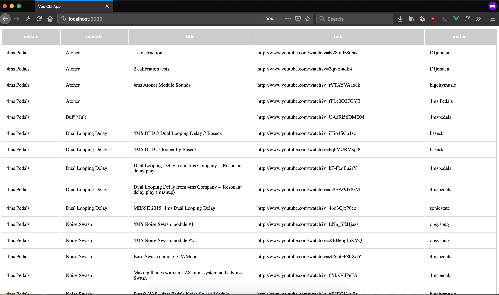

# Vue Sheet Provider

### Simple Vue JS Data Provider Component for Google Sheets.

`vue-sheet-provider` is a [Renderless UI Component](https://markus.oberlehner.net/blog/reusing-logic-with-renderless-vue-frame-components/) that wraps the functionality of [Sheetsy](https://github.com/TehShrike/sheetsy/) into composable Vue components.

Given markup structure that looks like this:

```html
<template>
  <div class="vue-sheet-provider-lib-dev">
    <workbook-provider :url="url">
      <template #default="{ sheetkey, workbook }">
        <sheet-provider v-if="workbook" :sheetkey="sheetkey" :sheetid="workbook.sheets[0].id">
          <template #default="{ sheet }">
            <table>
              <tr>
                <th v-for="(header, index) in sheet.headers" :key="index">
                  {{ header }}
                </th>
              </tr>
              <tr v-for="(row, index) in sheet.rows" :key="index">
                <td v-for="(cell, index) in row" :key="index">
                  {{ cell }}
                </td>
              </tr>
            </table>
          </template>
        </sheet-provider>
      </template>
    </workbook-provider>
  </div>
</template>
```

You get a rendered UI that looks like this:



---

## Installation

```sh
npm install @earthtone/vue-sheet-provider
```

## Google Spreadsheet setup

Since `vue-sheet-provider` is built on top of [Sheetsy](https://github.com/TehShrike/sheetsy/), the set up for the consumed Google Sheet is the same.

1. Create a spreadsheet with [Google Sheets](https://docs.google.com/spreadsheets/)
2. Navigate to the "File" menu
3. Click "Publish to the Web"
  - It should default to "Entire Document" + "Web page", which is what you want.
  - The defaults should be fine for "Published content & settings" as well - for maximum easiness, you'll want to "Automatically republish when changes are made".
5. Click "Publish"
6. Close the "Publish to the web" dialog
7. Click the blue "Share" button at the top-right
8. If you want to make it slightly harder for people to find your spreadsheet:
  1. Click "advanced" at the bottom-right of the "Share" dialog
  2. Under "Who has access", click "Change"
  3. Select "On - Anyone with the link"
  4. Click "Save"
9. Copy the "Link to share"

That URL is the one you'll use to load content from your page.

## Basic Usage

`vue-sheet-provider` provides two renderless components - `WorkbookProvider` and `SheetProvider` - that pass down the data from your Google Sheet using [scoped slots](https://vuejs.org/v2/guide/components-slots.html#Scoped-Slots).

### Workbook Provider

With the shareable sheet URL described above, the `WorkbookProvider` handles extracting the key used to request data. The `WorkbookProvider` can be used on its own to render workbook specific data, but sheet data is only accessible using the `SheetProvider` component with the `sheetky` and the `sheetid` data provided by the `WorkbookProvider`.

#### Props

- url
  - type: `String`
  - required: `true`

#### Slot Data

- sheetkey
  - type: `String`

- workbook
  - type: `Object`
  - [children](https://github.com/TehShrike/sheetsy/blob/master/readme.md#promise--getworkbookkey-httpget)

```json
{
  "name": "Copy of Eurorack Video Tutorials [last updated Dec 27 `15]",
  "updated": "2019-08-23T00:29:56.543Z",
  "authors": [
    {
      "name": "conrad.schnitzler",
      "email": "conrad.schnitzler@gmail.com"
    }
  ],
  "sheets": [
    {
      "name": "Eurorack Video Tutorials",
      "id": "od6",
      "updated": "2019-08-23T00:29:56.543Z"
    },
    {
      "name": "Added since Dec 27 '15",
      "id": "ohmo085",
      "updated": "2019-08-23T00:29:56.543Z"
    }
  ]
}
```

#### Example Usage in SFC

Template

```html
  <workbook-provider :url="url">
    <template #default="{ sheetkey, workbook }">
      <!-- Slot Data Available Here -->
    </template>
  </workbook-provider>
```

Script Section

```js
import { WorkbookProvider } from '@earthtone/vue-sheet-provider';

export default {
  name:  'data-table',
  components: {
    WorkbookProvider
  },
  computed: {
    url () {
      return process.env.VUE_APP_SHEET_URL
    }
  }
}
```

### Sheet Provider

Nesting the `SheetProvider` component within the default slot of the `WorkbookProvider` allows the passing of required props to the `SheetProvider` component necessary for requesting Google Sheet data. The `SheetProvider` also attaches important header data as a separate node, alongside the row data.

#### Props

- sheetkey
  - type: `String`
  - required: `true`

- sheetid
  - type: `String`
  - require: `true`

#### Slot Data

- sheet
  - type: `Object`
  - [children](https://github.com/TehShrike/sheetsy/blob/master/readme.md#promise--getsheetkey-id-httpget)

- sheet.headers
  - type: `Array`

```json
{
  "name": "Eurorack Video Tutorials",
  "updated": "2019-08-23T00:31:55.749Z",
  "authors": [
    {
      "name": "tonio.hubilla",
      "email": "tonio.hubilla@gmail.com"
    }
  ],
  "rows": [
      [
      "4ms Pedals",
      "Atoner",
      "1 construction",
      "http://www.youtube.com/watch?v=K28uidzSOns",
      "DJjondent"
    ],
    ...
    [
      "Zetangas Zaelectronics",
      "Cyclops II",
      "Cyclops II Eurorack Verison by Zetangas ZAelectronics",
      "http://www.youtube.com/watch?v=ZCPdhqKh8tc",
      "miip999"
    ]
  ],
  "headers": [
    "maker",
    "module",
    "title",
    "link",
    "author"
  ]
}
```

#### Example Usage in SFC

Template Section

```html
<div class="vue-sheet-provider-lib-dev">
  <workbook-provider :url="url">
    <template #default="{ sheetkey, workbook }">
      <sheet-provider v-if="workbook" :sheetkey="sheetkey" :sheetid="workbook.sheets[0].id">
        <template #default="{ sheet }">
          <table>
            <tr>
              <th v-for="(header, index) in sheet.headers" :key="index">
                {{ header }}
              </th>
            </tr>
            <tr v-for="(row, index) in sheet.rows" :key="index">
              <td v-for="(cell, index) in row" :key="index">
                {{ cell }}
              </td>
            </tr>
          </table>
        </template>
      </sheet-provider>
    </template>
  </workbook-provider>
</div>
```

Script Section

```js
import { WorkbookProvider, SheetProvider } from '@earthtone/vue-sheet-provider';

export default {
  name:  'data-table',
  components: {
    WorkbookProvider,
    SheetProvider
  },
  computed: {
    url () {
      return process.env.VUE_APP_SHEET_URL
    }
  }
}
```

---

## Development Notes

This package is compiled and packaged for NPM distribution using [vue-sfc-rollup](https://github.com/team-innovation/vue-sfc-rollup), which uses [Rollup](https://rollupjs.org/) for bundling and [Buble](https://buble.surge.sh/guide/) for transpiling.

Development was primarily done in a separate environment scaffolded out using [Vue CLI](https://cli.vuejs.org/), with testing done in [Jest](https://github.com/vuejs/vue-cli/tree/v3/packages/%40vue/cli-plugin-unit-jest). Due to the large differences in environments (buble vs babel, rollup vs webpack, etc), the complexity and lack of comprehensive documentation for setting up a testing solution for Vue SFCs without Vue CLI, continuous integration and comprehensive testing is being conducted separate from this repository.

Without continuous, automated testing and reporting, support is available and issues are encouraged to be reported, but usage of this compnent as development progresses is at your own risk.

Any advice/feedback in this regard would be greatly appreciated.
